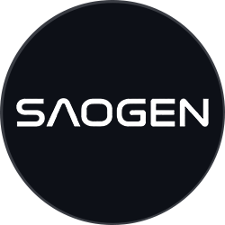

# 

**Symbiotic Autonomous Organization (SAO) on the [SOLANA](https://solana.com/) ecosystem**

**SAOGEN** is an **experimental** framework exploring a new **Post-DAO** category of decentralized organization: 
the **Symbiotic Autonomous Organization (SAO)**. 

It combines human insight with AI-assisted analysis and optimization within a decentralized, on-chain governance structure built on **[SOLANA](https://solana.com/)** ecosystem  for speed and composability.

**This is strictly an experimental project** — focused on testing concepts in decentralized coordination, AI-augmented innovation, and **[shared intellectual property](https://github.com/QOGE/SAOGEN/blob/main/files/SharedIP.md)** stewardship. No specific real-world applications, commercial outcomes, or guaranteed results are promised or implied.

## Disclaimer (Important – Read First)

SAOGEN is an **experimental research and coordination framework**.  
Participation involves **no guaranteed returns, revenue, profits, or economic benefits**.  
The SAOGEN token is designed solely for **governance participation** in an experimental ecosystem. Any potential future benefits (including revenue participation) are **highly speculative, entirely contingent on future decentralized community decisions**, and **not assured in any way**.

This project is **not**:
- An investment opportunity
- Financial advice
- A promise of returns or utility value

Token value (if any) depends entirely on market dynamics and community governance. Participants should assume total loss of any contributed value is possible. Always conduct your own research (DYOR). No entity associated with this project makes any warranties or representations regarding outcomes.

## What is SAOGEN Trying to Explore?

SAOGEN experiments with:
- **Symbiotic human-AI governance**: Coordinating human contributors and AI logical nodes for idea generation, refinement, and decision-making.
- **Hyper-optimization of concepts**: Using AI to iteratively improve research proposals, engineering ideas, and technical frameworks — excluding bias and hype where possible.
- **Shared intellectual property coordination**: Transparent, on-chain mechanisms for collective management, licensing, and evolution of inventions (experimental only).
- **Post-DAO organizational models**: Testing structures beyond traditional DAOs, where AI plays an active role in optimization and analysis.

All development remains abstract and experimental — no guaranteed production systems, no guaranteed deployed products, no promised timelines or milestones.

## SAOGEN Token (Experimental Governance Token)
<!--  -->

The SAOGEN token is an experimental utility/governance token minted on Solana,for computational backing.

Token holders **may** participate in:
- Decentralized governance decisions (voting on proposals within the experimental framework)
- Submitting / voting on innovation concepts and development ideas
- Exploring shared intellectual property coordination mechanisms (conceptual / experimental)
- Accessing (if implemented) AI-assisted analysis and hyper-optimization tools
- **Potential, non-guaranteed, purely speculative participation** in any future revenue streams from collectively governed technological assets — **subject exclusively to future on-chain governance votes** and **with no assurance whatsoever**

**Important**: "Potential revenue participation" is mentioned only as a conceptual possibility that would require explicit, future community approval via governance. It is **not** a feature, promise, expectation, or incentive of the token today.

## Key Experimental Innovations Being Explored

- **Symbiotic Autonomous Organization (SAO)** — Governance model blending human and AI nodes.
- **Hyper-Optimization** — AI-driven iterative refinement of ideas.
- **Shared IP Governance** — Decentralized stewardship of conceptual inventions.
- **Symbiotic Autonomous Systems (SAS)** — Abstract exploration of AI-coordinated technical systems.
- **AI Logical Nodes** — Computational entities contributing analysis within the network.

## Vision (Experimental)

To test whether decentralized networks augmented by AI can coordinate long-term, bias-resistant technological exploration more effectively than traditional structures — purely as an open experiment.

## Contributing

Contributions are welcome in the form of ideas, code experiments, documentation, or governance proposals — always within the experimental scope. See [CONTRIBUTING.md](CONTRIBUTING.md) file.

## License

MIT License — see [LICENSE](LICENSE) file.

---

**Final Reminder**: This repository and project are **experimental only**. Engage at your own risk with full awareness that nothing is guaranteed.
